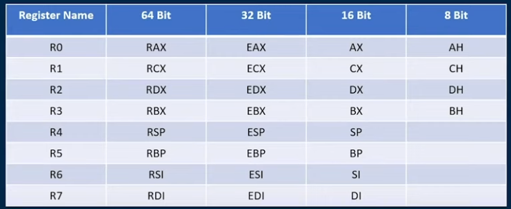

# **Lesson 1**
## **Computer Architecture 101**
### **Registers - x86_64 Architecture**
Small storage areas used by the processor. X86_64 uses 16 64 bt geeral purpose registers



**Special Registers**
* RIP: Instruction pointer 
* RFLAGS: Stores flags used for process flow control
* FPRO-FPR7: Floating point status and control registers
* RBP/RSP: Stack manipulation and usage

### **Instructions**
**mov:** Moves data from one register to another.
Examples:
```
mov rax, rbx # Moves the value stored in RBX to RAX
mov rax, [rcx] # Moves the value pointed to by RCX into RAX
```

**add:** Adss two values together, storing the result in the first argument
```
add rax,rbx # Adds rbx to rax, result stored in rax
```

**sub:** Substracts the second operand from the first one, storing result in the first operand
```
sub rax, rbx # Substracts rbx from rax, stores in rax
```

**and/xor:** perform logical operations and/xor on two operands following the same syntax as before

**pop**: Reads from the stack. Will load the value pinted to by rsp into the operand
```
pop rbx # Loads the value pointed by rsp into rbx, and dereases rsp by 8
```
**push**: writes to the stack. Will grow the stack by 8 and store the operand contents on the stack
```
push rax # Increases the value pointed to by rsp by 8, and stores rax there
```

Note that elements are popped in the reverse order than they are pushed into the stack. So the stack grows from high to low (higher memory addresses are at the bottom of the stack). RSP points to top of the stack and RBP contains the base pointer

**jmp:** is used to change what code is being executed. Modifies the next instruction pointer in EIP
 
 **call** is used to implement function calls. Pushes value of rbp and rip onto the stack before jumping

**cmp** performs a comparison operation by substracting the operands. No storage is performd but based on the result fields in RFLAGS are set. The flags in RFLAGS regiser are used by jmp variants
  * jnz: Jump if not zero
  * jz: Jump if zero

### **Addresing Modes**
Instructions can access memory in different modes. 
  * Immediate: The result is stored in the instruction ```add rax,14``` stores 14 into RAX
  * Register to Register: ```xor rax,rax;``` clears the value un rax
  * Indirect Access: ```add rax, [rbx];``` adds the value pointed to by rbx into rax while ```mov rbx, 1234[8*rax+rcx]``` move word at address 8*RAX+RCX+1234 into rbx

# References
All credit to HackadayU :https://www.youtube.com/@hackaday